# TechIndustry

TechIndustry is a scalable, production-ready web platform for IT education, skill development, and automated knowledge assessment. The project is designed with a strong focus on clean architecture, performance, and real-world learning workflows.

---

## Overview

TechIndustry provides a modern Learning Management System (LMS) that enables users to study structured IT courses, track progress in real time, and receive certificates upon course completion. The platform supports both authenticated users and guests, ensuring an accessible entry point while preserving full functionality for registered learners.

---

## Technologies

The platform is built using a robust and maintainable technology stack:

* **Backend:** Node.js, Express.js
* **Database:** PostgreSQL
* **ORM:** Sequelize
* **Architecture:** Layered MVC (Routes, Controllers, Services, Models)
* **Templating:** Handlebars (HBS)
* **Authentication:** JWT-based authentication
* **Security:** Helmet (CSP, HSTS), CSRF protection, Rate limiting, Input sanitization
* **Performance:** Compression (gzip), static asset caching, SSR-friendly rendering
* **UI/UX:** Custom CSS (Glassmorphism), responsive layout, modern typography
* **Environment Configuration:** Secure `.env` configuration

## Performance & Security

- **Compression enabled** for responses (gzip)  
- **Static caching** for `public/` and `assets/` with long-lived cache headers  
- **Helmet with CSP + HSTS** for safer SSR pages and CDN assets  
- **Global rate limiter** to protect endpoints
- **CSRF protection** enabled (csrf token exposed to templates)
- **Mongo sanitize** middleware for payload safety (works as extra hardening)

---

## Screenshots

### Home Page
Main landing page with platform overview and featured courses.


### Course Catalog
Browse all available courses and learning tracks.
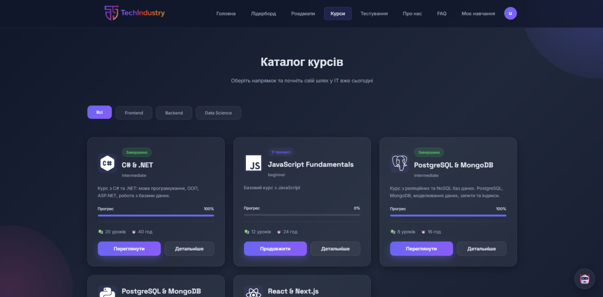

### Course View
Detailed course structure with modules and lessons.
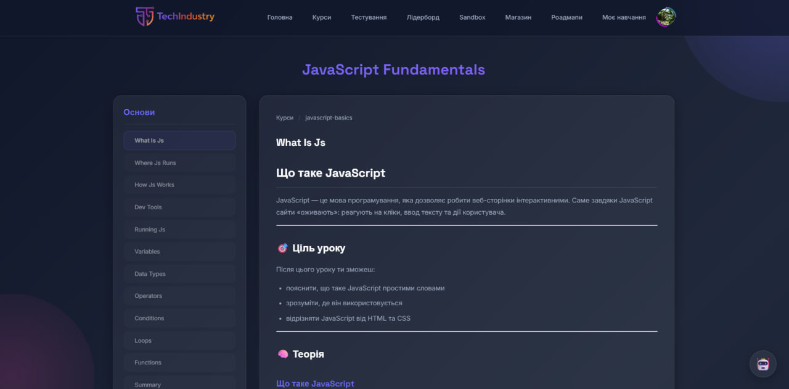

### User Profile
Personal dashboard with progress, statistics, and achievements.


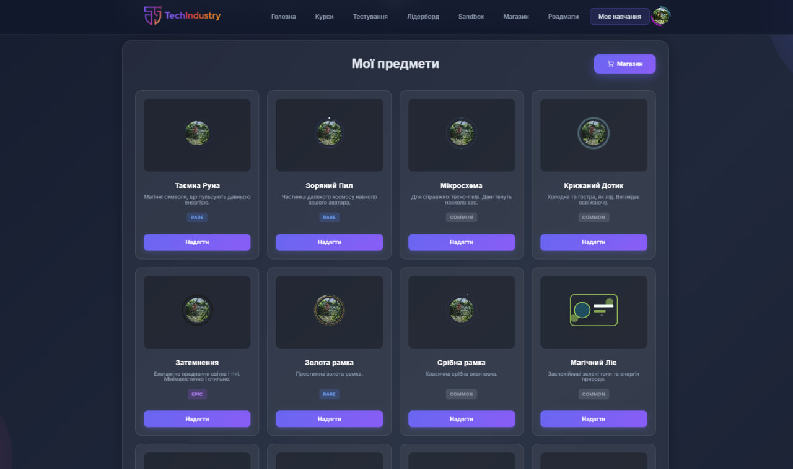

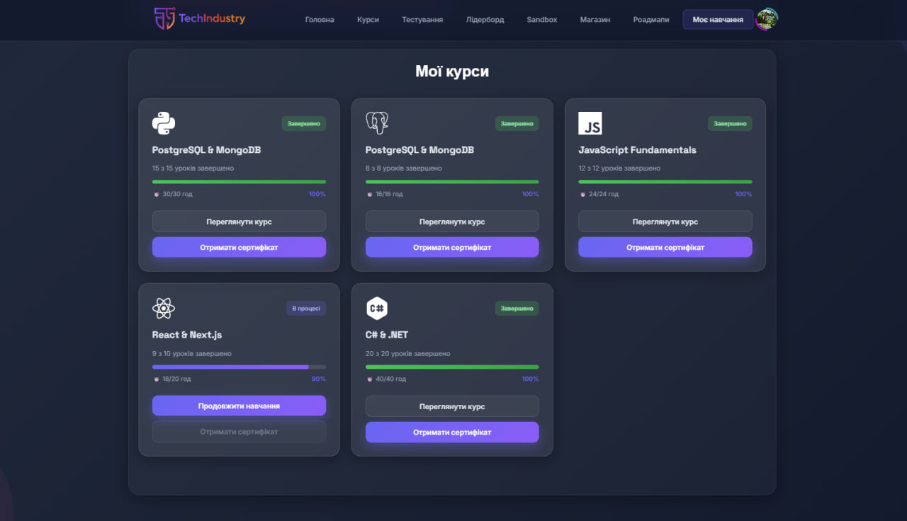

### Leaderboard & Achievements
Top users, ranking system, and gamification stats.
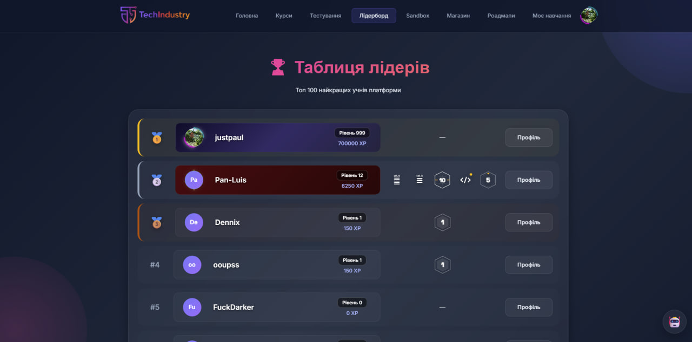

### Quiz & Testing System
Interactive quiz center and module tests.
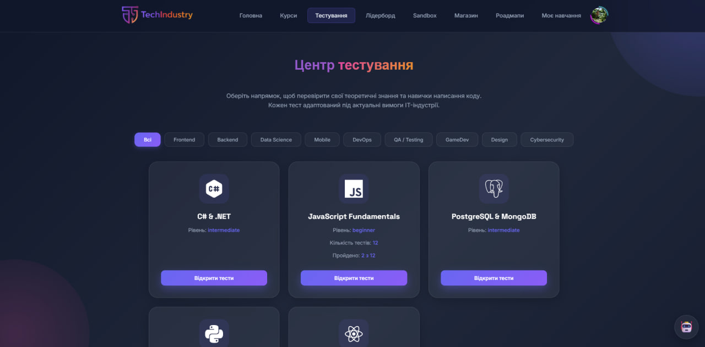

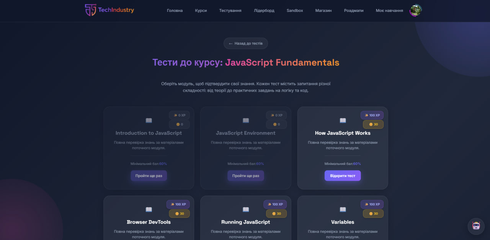

### Q&A / Knowledge Section
Additional learning and knowledge validation.
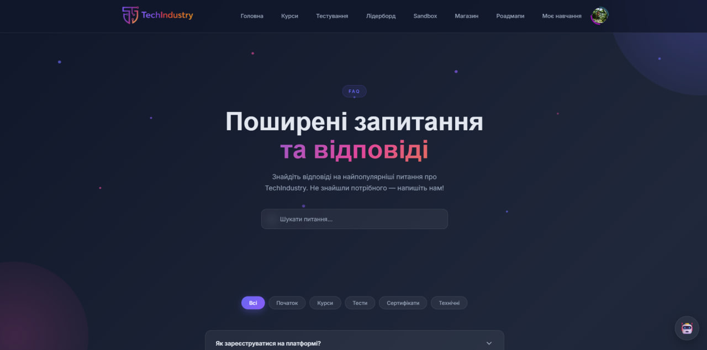

### Learning Roadmaps
Structured learning paths and skill progression.
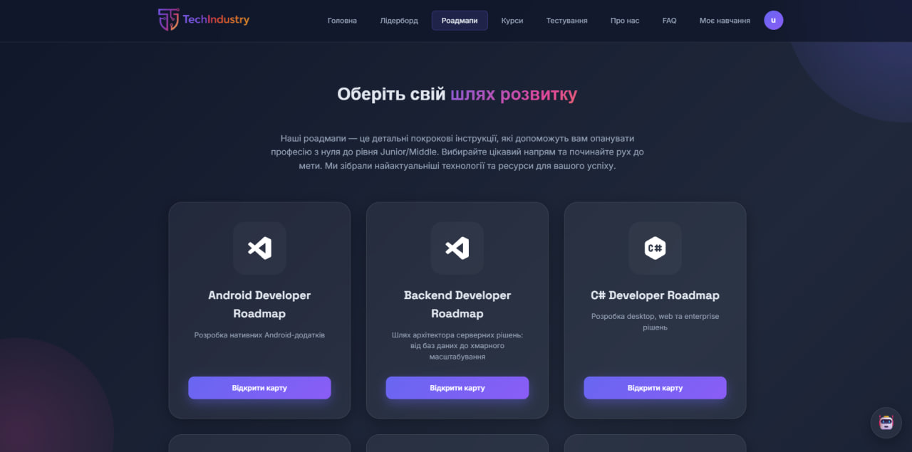

### Shop & Profile Customization
Cosmetics, rewards, and coin-based economy.
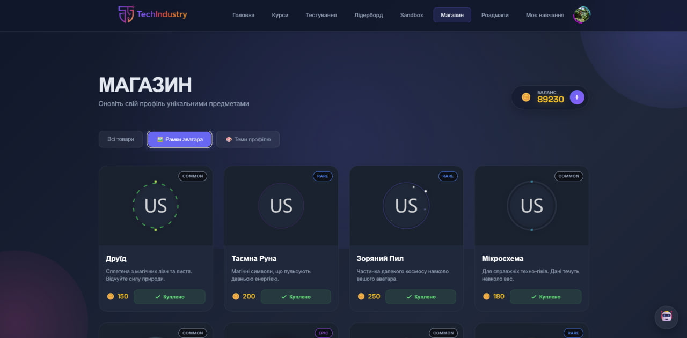

### Code Sandbox
Built-in coding playground for experimentation.
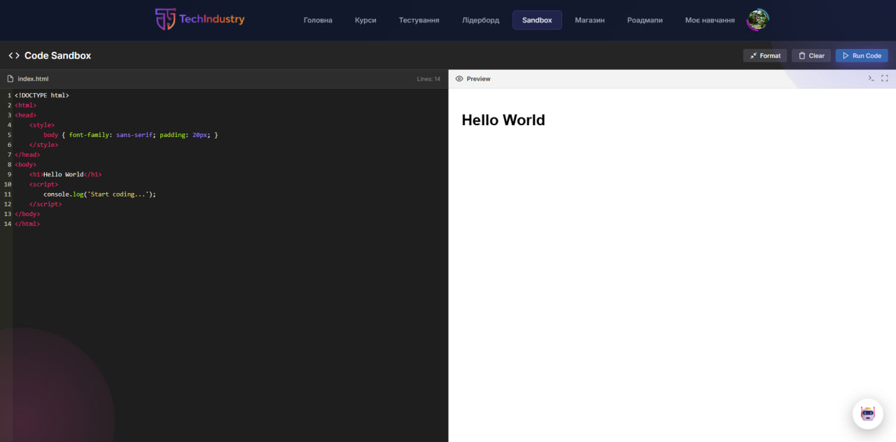


---

## Core Features

### Learning Management System (LMS)

* Modular course structure (Courses → Modules → Lessons)
* Interactive lesson content with rich text and code examples
* Course categorization (Frontend, Backend, DevOps, Data Science)
* Fully responsive interface for desktop and mobile devices

### User Progress Tracking

* Automatic lesson completion tracking
* Persistent progress storage in PostgreSQL
* Real-time progress visualization (percentages, progress bars)
* Course status states: not started, in progress, completed

### Automated Assessment

* Module-based quizzes
* Instant validation of answers
* Detailed feedback for incorrect responses
* Progress analytics and learning insights

### Gamification & Economy

* XP rewards for lessons/quizzes and course completion
* Coins economy (earn + spend), balance tracking
* Levels and badges system (progress-based achievements)
* Leaderboard with top users and stats

### Profile Customization (Shop / Inventory)

* In-app Shop with categories and purchasable items
* Inventory page to manage owned cosmetics and upgrades
* Equip / unequip mechanics for profile customization:
  * Avatar frames
  * Title badges
  * Profile themes
* Purchase history / transaction history support

### Code Sandbox

* Built-in Sandbox page for experimenting with code and ideas
* Designed for quick practice without leaving the platform

### Certification System

* Automatic course completion verification
* Secure PDF certificate generation
* Certificate availability checks via API
* Inline certificate preview and download

### Authentication & Access Control

* JWT-based user authentication
* Secure protected routes
* Guest access with limited functionality
* Automatic token validation and expiration handling

---

## Frontend Behavior

* Guests can browse public content (courses, roadmaps, leaderboard, info pages).
* Authenticated users unlock progress tracking, quizzes, certificates, shop, and profile customization.
* Restricted actions (quizzes, certificates, shop, profile features) require login and automatically redirect guests.
* UI dynamically changes based on authentication state (navigation, progress indicators, gamification stats, customization features).
* Private user pages (profile, settings, quizzes, certificates, shop, inventory) are excluded from search indexing.
* Public pages are optimized for SEO and performance using SSR, dynamic meta tags, canonical URLs, lazy loading, and optimized font loading.


---

## Repository Structure

* **main** – Project documentation, configuration, and metadata
* **dev** – Active development branch
* **feature/** – Feature-specific branches (authentication, quizzes, certificates, etc.)
* **fix/** – Hotfix branches for critical issues
* **refactor/** – Code refactoring, performance improvements, and internal optimizations without changing functionality  

---

## Getting Started

### Prerequisites

* Node.js (LTS recommended)
* PostgreSQL

### Installation

1. Clone the repository:

```bash
git clone https://github.com/polchduikt/TechIndustry.git
cd TechIndustry
```

2. Install dependencies:

```bash
npm install express cookie-parser dotenv jsonwebtoken express-validator multer sequelize
```

3. Configure environment variables:

Create a `.env` file in the project root and define:

```
PORT=3000
DB_HOST=localhost
DB_PORT=5432
DB_NAME=your_db
DB_USER=your_user
DB_PASSWORD=your_password
JWT_SECRET=your_secret_key
EMAIL_USER=your_email
EMAIL_PASSWORD=your_password
GROQ_API_KEY=key
GOOGLE_CLIENT_ID=your_client_id
GOOGLE_CLIENT_SECRET=you_client_secret
GOOGLE_CALLBACK_URL=callback_url
NODE_ENV=development
```

4. Run database migrations and start the server:

```bash
npm run dev
```

---

## API Highlights
## Public APIs (No Authentication Required)

### Authentication

* `POST /api/auth/register` – Register a new user with optional avatar upload
* `POST /api/auth/login` – User login (returns a JWT token)

### Courses & Roadmaps

* `GET /api/courses` – Retrieve the full catalog of available courses
* `GET /api/courses/:slug` – Get detailed course information (modules, descriptions)
* `GET /api/courses/lessons/:lessonId` – Retrieve lesson content and materials
* `GET /api/roadmaps/:id` – Load a structured learning roadmap (frontend, backend, etc.)

### Quizzes & Assessments

* `GET /api/courses/:slug/quizzes` – List available quizzes for a specific course
* `GET /api/courses/:slug/quizzes/:moduleId` – Retrieve quiz questions (without correct answers)
* `POST /api/courses/:slug/quizzes/:moduleId/submit` – Submit quiz answers for server-side validation


## Protected APIs (Authentication Required)

### Profile Management

* `GET /api/auth/profile` – Retrieve the current user profile data
* `PATCH /api/auth/update-profile` – Update email, phone number, or username
* `PATCH /api/auth/change-password` – Secure password change with old password verification
* `POST /api/auth/upload-avatar` – Upload or replace profile avatar (Base64)
* `DELETE /api/auth/delete-avatar` – Remove the current profile avatar

### Learning Progress

* `GET /api/progress` – Retrieve all enrolled courses with their progress status
* `POST /api/progress/start` – Start a new course and create a progress record
* `GET /api/progress/course/:courseSlug` – Retrieve detailed progress for a specific course
* `POST /api/progress/lesson` – Mark a lesson as completed

### Certificates

* `GET /api/certificates/check/:courseId` – Check certificate eligibility
* `GET /api/certificates/generate/:courseId` – Generate a certificate record
* `GET /api/certificates/download/:courseId` – Download the certificate as a PDF file

---

## Project Status

The project is actively developed and continuously improved. Current priorities include performance optimization, extended analytics, and enhanced assessment logic.

---

## License

This project is licensed under the MIT License.
