# TechIndustry — Interactive IT Learning Platform LMS

[](docs/API_DOCUMENTATION.md)
[](docs/ARCHITECTURE.md)
[](LICENSE)

[](https://nodejs.org/)
[](https://expressjs.com/)
[](https://www.postgresql.org/)
[](https://sequelize.org/)
[](https://handlebarsjs.com/)
[](https://jwt.io/)
[](https://developers.google.com/identity)
[](https://groq.com/)
[](https://pdfkit.org/)
[](https://helmetjs.github.io/)
[](https://azure.microsoft.com/)

---

## Overview

**TechIndustry** is a scalable, modern Learning Management System (LMS) and IT education platform designed for interactive studying, real-time knowledge verification, and community gamification. Built with a robust **Layered MVC Architecture** on **Node.js (Express 5)**, **PostgreSQL (Sequelize ORM)**, and **Handlebars SSR**, the platform delivers structured learning tracks across modern software engineering domains (Frontend, Backend, DevOps, QA, Data Science, and Cybersecurity).

The platform features an automated assessment system with instant quiz evaluation, dynamic cryptographic and vector-rendered **PDF certificate generation**, an intelligent **Groq-powered AI tutor (LLaMA 3.3)** with topic guardrails, a full virtual economy with **XP, levels, badges, and cosmetic customization**, and an interactive in-browser **Code Sandbox**.

<p align="center">
  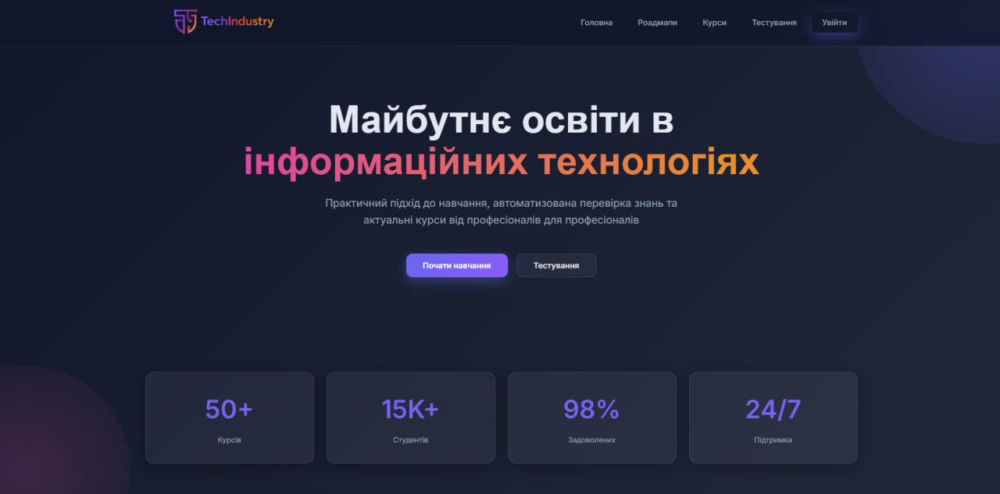
</p>

---

## Tech Stack

### Backend & Core Engine — `src/`
- **Node.js 20.x** & **Express.js 5.x**: High-performance HTTP server and asynchronous request handling
- **Layered MVC Architecture**: Strict modular separation of Routes, Controllers, Services, Middleware, and Models
- **PostgreSQL 16 & Sequelize ORM**: Relational database persistence with schema associations and transaction management
- **JWT & Session Security**: Stateless JWT token authentication paired with secure session cookie context caching
- **Google OAuth 2.0 SSO**: Multi-provider authentication with automatic account linking
- **Security & Hardening Stack**:
  - **Helmet**: Content Security Policy (CSP) and HTTP Strict Transport Security (HSTS)
  - **CSURF**: Double-submit cookie CSRF defense for all mutation forms
  - **Express Rate Limit**: Tiered token-bucket rate limiters on sensitive endpoints (Auth, AI, Shop, Quizzes)
  - **Mongo Sanitize & HPP**: Defense-in-depth sanitization against NoSQL/parameter pollution attacks
  - **Input Validation**: Declarative request validation and XSS prevention via `express-validator` and `xss`
- **Groq AI Integration**: `llama-3.3-70b-versatile` AI mentor with strict domain prompts and anti-jailbreak filters
- **PDFKit Engine**: Dynamic vector rendering of verifiable completion certificates with custom typography
- **Sharp**: High-efficiency image processing, resizing, and avatar transformation pipeline
- **Nodemailer**: SMTP email verification, activation codes, and password recovery workflows
- **Compression**: Adaptive gzip response compression with threshold filtering

### Frontend & SSR View Layer — `src/views/` & `public/`
- **Handlebars (HBS) SSR**: Server-rendered dynamic views with reusable partials and custom helper functions
- **Modern Responsive UI**: Custom Glassmorphism styling with dark/light visual hierarchy and CSS variables
- **Dynamic Context Injection**: Real-time user session context, coin balances, and equipped avatar frames
- **Interactive Code Sandbox**: Client-side code editor for rapid coding experiments and algorithm testing
- **SEO & Social Optimization**: Dynamic OpenGraph tags, canonical links, structured sitemap.xml, and robots.txt
- **Zero-Friction Client UX**: Asynchronous JSON APIs with optimistic UI feedback and toast notifications

### Cloud & Deployment — `.github/workflows/`
- **Azure App Service**: Production cloud container runtime with auto-scaling
- **GitHub Actions CI/CD**: Automated deployment pipeline (`main_techindustry.yml`) on commit push
- **Cloud Database Management**: PostgreSQL connection pooling with SSL encryption options

---

## Core Features

- **Structured Course Curricula**: 13+ industry-aligned learning tracks (C#/.NET, Python, React, DevOps, QA, Kotlin, Java, Data Science, etc.) structured hierarchically into **Courses → Modules → Lessons**.
- **Markdown Lesson Engine**: Rich-text technical lesson rendering with syntax-highlighted code snippets and interactive navigation.
- **Automated Quiz & Assessment System**: Module-level quizzes with server-side validation, instant scoring, question shuffling, and immediate feedback.
- **Real-Time Progress Tracking**: Persistent course and lesson tracking in PostgreSQL with percentage calculations and status states (*Not Started*, *In Progress*, *Completed*).
- **Verifiable PDF Certificates**: Automated generation of branded, verifiable PDF certificates upon 100% course completion with inline preview and direct download.
- **Gamification & Virtual Economy**:
  - **XP & Levels Engine**: Experience points earned from lessons and quizzes with tiered rank progression (up to Level 1000+).
  - **Achievement Badges**: Automated unlocking of milestone badges (Level milestones, First Course, Multi-Course completions, Perfect Quizzes).
  - **Coins Economy**: Virtual currency awarded for learning actions with atomic transaction history (`CoinTransaction`).
  - **Global Leaderboard**: Competitive user ranking based on experience, level, and completed courses.
- **Shop & Profile Customization**: In-app cosmetics marketplace featuring avatar frames, title badges, and profile themes with equip/unequip functionality.
- **AI Learning Assistant (LLaMA 3.3)**: Built-in Groq AI mentor providing contextual explanations with anti-spam protections and domain restrictions (IT & platform only).
- **Interactive Code Sandbox**: Built-in coding playground for rapid experimentation without leaving the learning environment.
- **Enterprise-Grade Security**: Helmet headers, CSRF tokens, strict rate limiting, secure password hashing (Bcrypt), and PII protection.

---

## System Architecture & Patterns

TechIndustry follows a decoupled, layered MVC monolithic architecture with strict separation between routing, controllers, business services, and data models.

```
                    ┌─────────────────────────┐
                    │      Client Browser     │
                    └────────────┬────────────┘
                                 │ HTTP / HTTPS
                                 ▼
                    ┌─────────────────────────┐
                    │    Security & Armor     │
                    │  (Helmet, RateLimit,    │
                    │   CSRF, MongoSanitize)  │
                    └────────────┬────────────┘
                                 │
                    ┌────────────▼────────────┐
                    │   Express 5 Dispatcher  │
                    └──────┬───────────┬──────┘
                           │           │
            ┌──────────────▼─────┐   ┌─▼──────────────────┐
            │    Page Routes     │   │     API Routes     │
            │    (SSR Engine)    │   │ (JSON Endpoints)   │
            └──────────────┬─────┘   └─┬──────────────────┘
                           │           │
                    ┌──────▼───────────▼──────┐
                    │  Controllers Layer      │
                    └────────────┬────────────┘
                                 │
                    ┌────────────▼────────────┐
                    │  Business Services      │
                    │ (Gamification, AI,      │
                    │  Certificates, Auth)    │
                    └────────────┬────────────┘
                                 │
                    ┌────────────▼────────────┐
                    │  Sequelize ORM Models   │
                    └────────────┬────────────┘
                                 │ SQL
                    ┌────────────▼────────────┐
                    │   PostgreSQL Database   │
                    └─────────────────────────┘
```

Detailed architectural specifications & request lifecycles: [docs/ARCHITECTURE.md](docs/ARCHITECTURE.md)

---

## Screenshots & Platform Tour

<table width="100%">
  <tr>
    <td width="50%" align="center">
      <b>Home Page</b><br/><br/>
      
    </td>
    <td width="50%" align="center">
      <b>Course Catalog</b><br/><br/>
      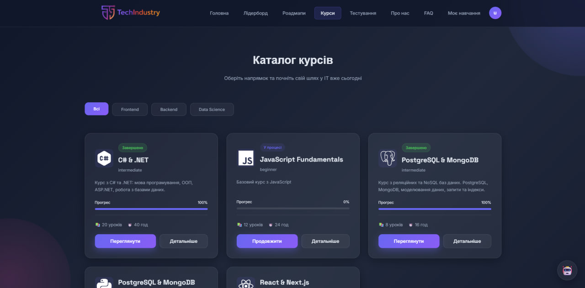
    </td>
  </tr>
  <tr>
    <td width="50%" align="center">
      <b>Course View & Lessons</b><br/><br/>
      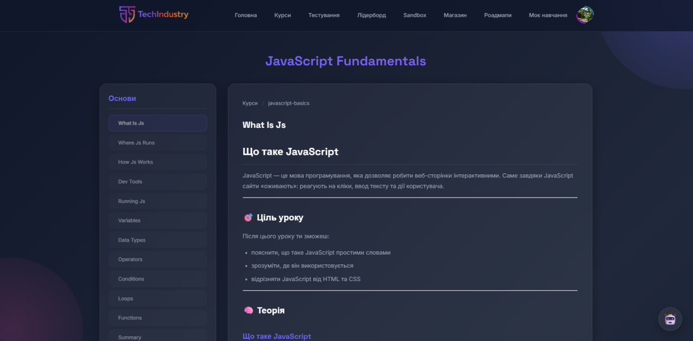
    </td>
    <td width="50%" align="center">
      <b>User Profile Dashboard</b><br/><br/>
      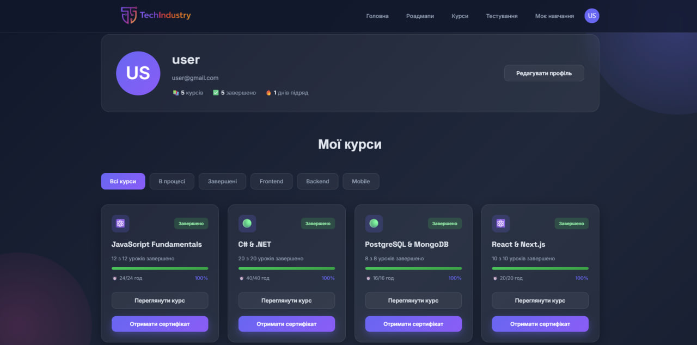
    </td>
  </tr>
  <tr>
    <td width="50%" align="center">
      <b>Profile Achievements & Stats</b><br/><br/>
      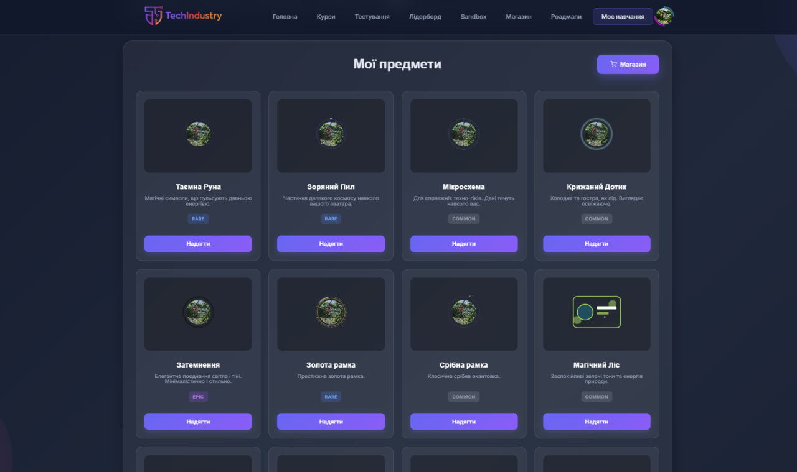
    </td>
    <td width="50%" align="center">
      <b>Profile History & Badges</b><br/><br/>
      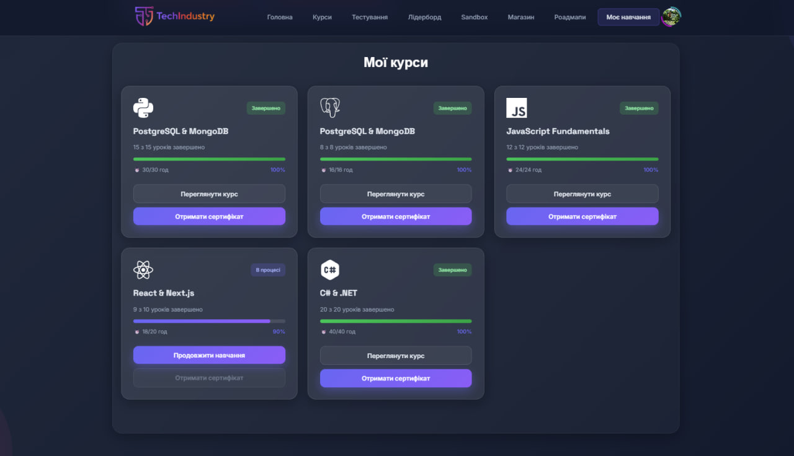
    </td>
  </tr>
  <tr>
    <td width="50%" align="center">
      <b>Global Leaderboard</b><br/><br/>
      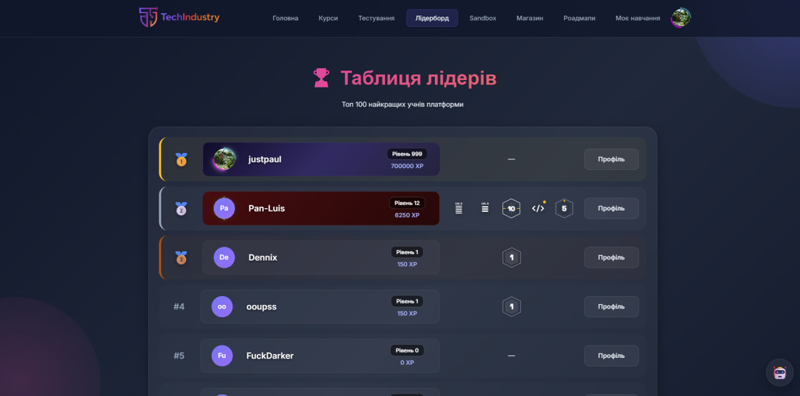
    </td>
    <td width="50%" align="center">
      <b>Quiz & Assessment Center</b><br/><br/>
      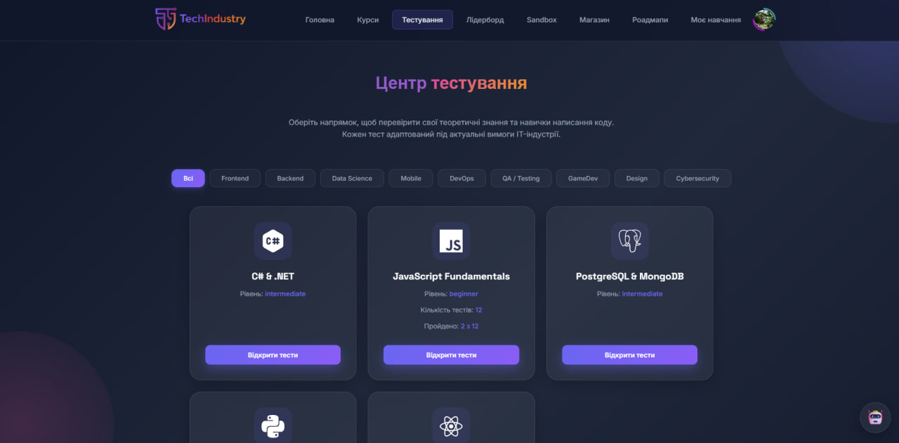
    </td>
  </tr>
  <tr>
    <td width="50%" align="center">
      <b>Interactive Quiz View</b><br/><br/>
      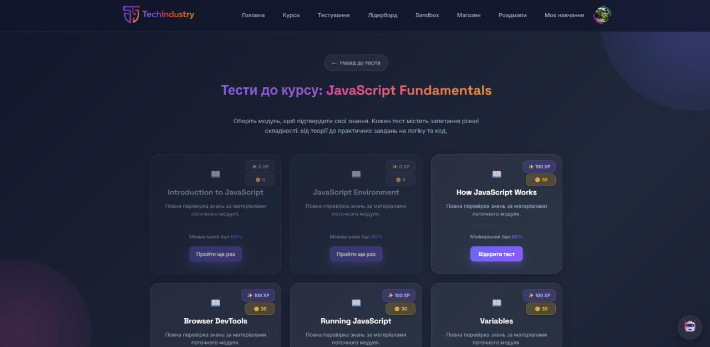
    </td>
    <td width="50%" align="center">
      <b>Learning Roadmaps</b><br/><br/>
      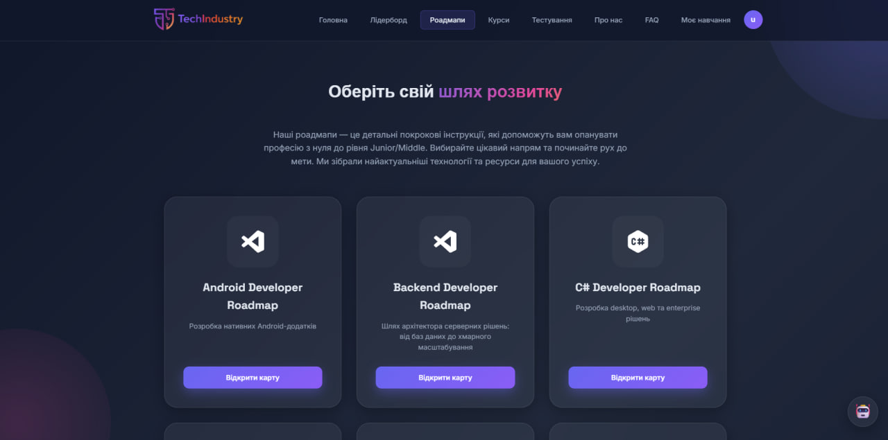
    </td>
  </tr>
  <tr>
    <td width="50%" align="center">
      <b>Q&A Knowledge Base</b><br/><br/>
      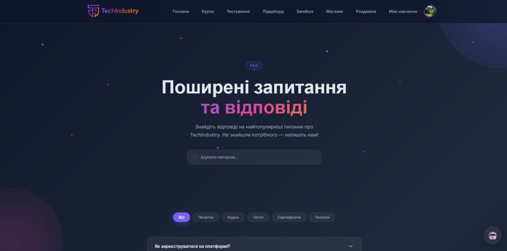
    </td>
    <td width="50%" align="center">
      <b>Cosmetics Shop & Economy</b><br/><br/>
      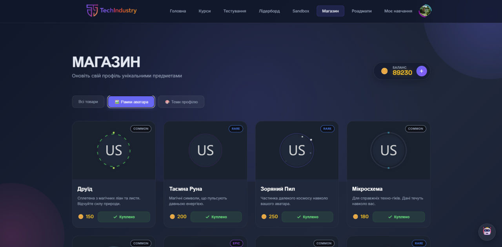
    </td>
  </tr>
  <tr>
    <td width="100%" align="center" colspan="2">
      <b>Interactive Code Sandbox</b><br/><br/>
      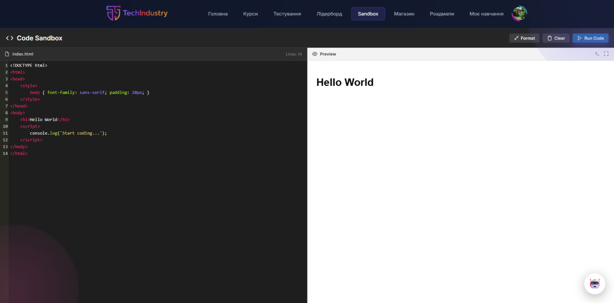
    </td>
  </tr>
</table>

---

## Repository Structure

```
tech-industry/
├── .github/
│   └── workflows/
│       └── main_techindustry.yml        # CI/CD: Automated Azure Web App deployment pipeline
├── assets/
│   ├── fonts/                           # Custom web fonts (Inter Regular & Bold)
│   ├── img/                             # Platform branding, logo, and favicons
│   └── screenshots/                     # Platform preview images and UI screenshots
├── content/
│   └── courses/                         # 13+ Course curricula in structured Markdown & JSON
│       ├── csharp-dotnet/               # C# & .NET Core curriculum
│       ├── cybersecurity-engineering/   # Cybersecurity engineering track
│       ├── data-science-engineering/    # Data science & analytics track
│       ├── design-fundamentals/         # UI/UX design track
│       ├── devops-engineering/          # DevOps & cloud infrastructure track
│       ├── java-core/                   # Java core & enterprise track
│       ├── javascript-basics/           # JavaScript fundamentals track
│       ├── kotlin-core/                 # Kotlin core & Android track
│       ├── postgresql-and-mongodb/      # Database engineering track
│       ├── python-for-data/             # Python data & automation track
│       ├── qa-engineering/              # QA engineering & automation track
│       ├── react-next/                  # React & Next.js ecosystem track
│       └── typescript-core/             # TypeScript mastery track
├── docs/
│   ├── API_DOCUMENTATION.md             # Complete REST API specification & schemas
│   └── ARCHITECTURE.md                  # Comprehensive system architecture & patterns
├── public/                              # Static public assets (CSS stylesheets, JS, robots.txt, sitemap.xml)
├── src/
│   ├── config/                          # Database connection pool, rate limits, constants, content seeders
│   ├── controllers/                     # Route controllers (Auth, Courses, Quizzes, Certificates, Shop, etc.)
│   ├── helpers/                         # Custom Handlebars template helpers & formatters
│   ├── middleware/                      # Auth guards, page protection, SEO defaults, rate limiting
│   ├── models/                          # Sequelize models (User, Customer, Course, Module, Lesson, Progress, Shop)
│   ├── routes/                          # Express route declarations (REST API & SSR pages)
│   ├── services/                        # Domain business logic (AI, Gamification, Certificates, Progress, Shop)
│   └── views/                           # Handlebars view templates
│       ├── pages/                       # SSR page layouts (Home, Profile, Course, Quiz, Settings, Shop)
│       └── partials/                    # Reusable UI partials (Navbar, Footer, Sidebar, Cards, Modals)
├── server.js                            # Application entry point, security middleware pipeline & server bootstrap
├── package.json                         # Node.js dependencies, scripts, and package metadata
└── LICENSE                              # Project license (MIT)
```

---

## Running Locally

Follow these step-by-step instructions to run TechIndustry on your local environment:

### Prerequisites
- **Node.js**: `v20.x` or higher (LTS recommended)
- **npm**: `v10.x` or higher
- **PostgreSQL**: `v15.x` or `v16.x`

### 1. Clone the Repository
```bash
git clone https://github.com/polchduikt/TechIndustry.git
cd TechIndustry
```

### 2. Install Dependencies
```bash
npm install
```

### 3. Environment Configuration
Create a `.env` file in the root directory:

```env
PORT=3000
NODE_ENV=development

# Database Configuration
DB_HOST=localhost
DB_PORT=5432
DB_NAME=techindustry_db
DB_USER=postgres
DB_PASSWORD=your_password

# Authentication & Security
JWT_SECRET=your_super_secret_jwt_key_here
USER_CONTEXT_CACHE_MS=60000

# Google OAuth 2.0 (Optional)
GOOGLE_CLIENT_ID=your_google_client_id
GOOGLE_CLIENT_SECRET=your_google_client_secret
GOOGLE_CALLBACK_URL=http://localhost:3000/api/auth/google/callback

# Groq AI Service (Optional)
GROQ_API_KEY=your_groq_api_key

# Email SMTP Service (Optional)
EMAIL_USER=your_email@gmail.com
EMAIL_PASSWORD=your_app_password
```

### 4. Database Setup & Seeding
Ensure PostgreSQL is running and create the target database:

```sql
CREATE DATABASE techindustry_db;
```

Seed the courses and curriculum content:

```bash
node src/config/seeders/syncCoursesFromContent.js
node src/config/seeders/syncLessonsFromContent.js
```

### 5. Start Development Server
```bash
npm run dev
```

The application will be accessible at [http://localhost:3000](http://localhost:3000).

---

## Documentation Index

All architectural choices, setup guides, and project specifications are documented in the repository:

- [docs/ARCHITECTURE.md](docs/ARCHITECTURE.md) — System architecture, layered request lifecycles, and design patterns.
- [docs/API_DOCUMENTATION.md](docs/API_DOCUMENTATION.md) — Complete REST API specification, request/response schemas, and rate limits.
- [LICENSE](LICENSE) — Project licensing terms (MIT License).

---

## Status

TechIndustry is actively maintained, continuously updated with new course tracks, gamification mechanics, and architectural enhancements.

---

## License

This project is licensed under the [MIT License](LICENSE).
